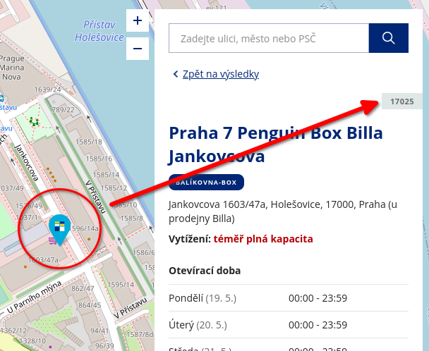

# Import ze souboru

## Speciální případy integrace

### Jak importovat zásilky s dopravcem Zásilkovna

V případě zásilek s dopravce Balíkovna, musíte v import souboru dodžet následující pravidla:
 - sloupec `carrier` obsahuje kod `balikovna`

U **Balíkovny** musíte specifikovat jak podací tak výdejní místo. Toto je podmínka pro vytvoření nabídky dopravy. Importní soubor tedy bude obsahovat minimálně tyto dva sloupce specifikující **podací** a **výdejní** místo **Balikovny**:
 - `pickup_branch_code`  - může obsahovat jakýkoliv kód, je jedno kam je zásilka odnesena ale musí to být kód balíkovny
 - `delivery_branch_code` - kód místa pro vyzvednutí

Sloupce zásilek obsahují kody podacích výdejních míst balíkovny.

Kód místa naleznete na [mapě poboček balíkovny](https://www.balikovna.cz/cs/vyhledat-balikovnu) v detailu karty konkrétního místa.

