# UpGates eshop

## Návod na spuštění integrace Upgates s Manažerem zásilek

**S naší integrací nemusíte objednávky přepravy zásilek do [Zaslat](http://zaslat.cz/) zadávat ručně, stačí si na pár kliknutí nastavit propojení a objednávky odbavovat jedním tahem.**

::: tip Náš tip
➡️ **Díky tomuto řešení odpadá veškeré stahování a nahrávání CSV souborů nebo ruční editace souborů v tabulkovém procesoru.**
:::

Díky integraci se vám údaje o zásilkách z Upgates nahrají do Manažeru zásilek automaticky. A co více, pokud bude v datech nějaký nedostatek (například zákazník vyplní chybné telefonní číslo), tak můžete tento nedostatek přímo v Manažeru zásilek napravit.

Následně lze vše naráz objednat, objednat jen některé zásilky nebo snadno změnit dopravce. Možností je mnoho.

## **Nastavení integrace**

### **Aktivace pluginu do Upgates**

Navštivte webové stránky Upgates na následující adrese: [**https://doplnky.upgates.cz/detail/zaslat**](https://doplnky.upgates.cz/detail/zaslat)

Dostanete se na stránku pluginu Zaslat, který si nyní aktivujte (Obr. 1).

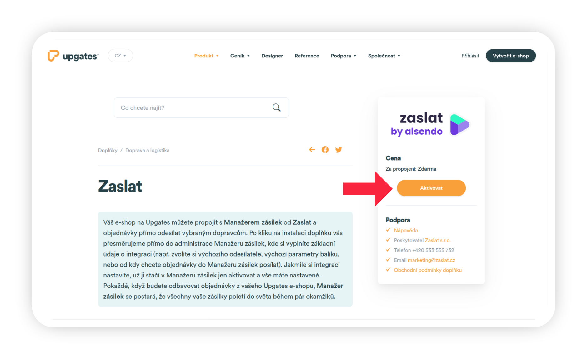

_Obrázek 1: Karta pluginu Zaslat v Upgates_

Plugin Zaslat se vám nahraje přímo do administrace doplňků ve vašem e-shopu od Upgates. Tady opět klikněte na tlačítko Aktivovat (Obr. 2).

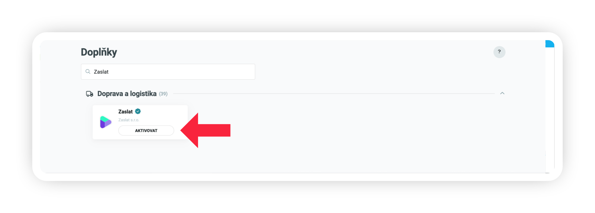

_Obrázek 2: Aktivace pluginu Zaslat v Upgates_

Vyskakovací okno potvrďte (Obr. 3). 

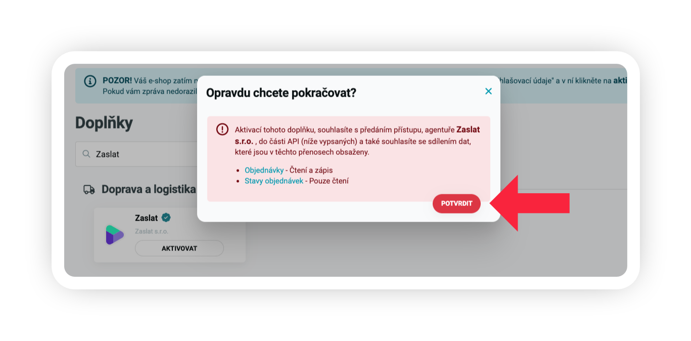

_Obrázek 3: Potvrzení aktivace doplňku_

Po kliknutí na tlačítko Potvrdit vás systém přesměruje do Manažera zásilek od Zaslat (Obr. 4), kde dokončíte integraci. V případě, že již máte účet pro firmy na Zaslat, přihlaste se. V opačném případě se můžete zdarma zaregistrovat a využívat všechny výhody Zaslat pro firmy.

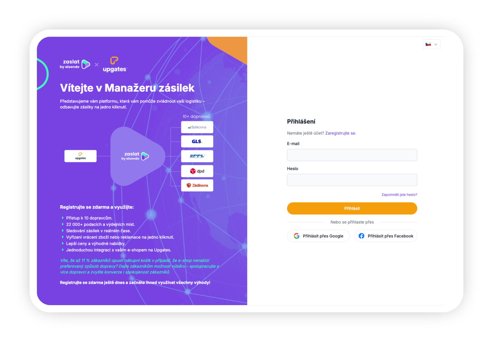

_Obrázek 4: Přihlášení/registrace do Manažera zásilek od Zaslat_

# **Nastavení v Zaslat**

Zvolte si libovolný Název této integrace (Obr. 5, krok 1). V řádku **Stahovat objednávky** (Obr. 5, krok 2) zvolte jednu z možností - **Všechny objednávky**, **Jen ve stavu Zaslat**, **Jen ve stavu Zpracovává se**, nebo si případně můžete definovat **Vlastní stav**.

Pokud máte nastavený v administraci Upgates vlastní stav Zaslat, pak zde zvolte možnost **Jen ve stavu Zaslat** pro stahování pouze objednávek v tomto stavu.

V Manažeru zásilek si poté zvolte **Výchozí adresu odesílatele** (Obr. 5, krok 3) z vašeho adresáře. Na vybrané adrese si dopravce zásilky vyzvedne. Pokud budete chtít u některé zásilky nastavit adresu odesílatele jinou, nevadí, změnu můžete provést později.

Pokud má každá vaše zásilka jiný rozměru a váhu, můžete tuto možnost ponechat prázdnou a rozměry poté doplnit ručně. Pokud posíláte všechny zásilky stejného tvaru a váhy, zvolte si nyní váš požadovaný rozměr v řádku **Výchozí balík** (Obr. 5, krok 4). V možnostech si vybíráte z vašich uložených Šablon zásilek.

Na závěr klikněte na tlačítko **Uložit změny** (Obr. 5, krok 5).

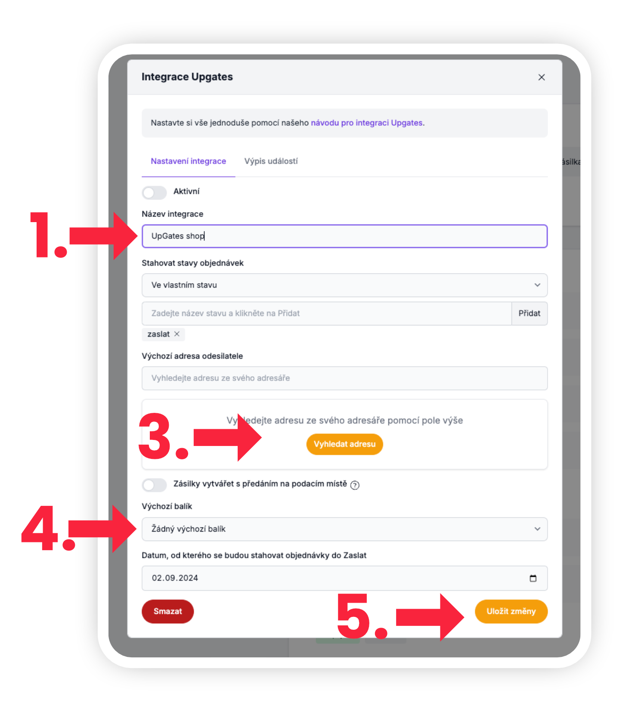

_Obrázek 5: Nastavení integrace v Manažeru zásilek_

## **Další nastavení v Upgates**

### Nastavení dopravců v Upgates

#### Výběr z přednastavených dopravců

V nové verzi integrace už **nepoužíváme možnost „Vlastní přeprava“**, jak tomu bylo dříve, ale vybíráme z **přednastavených dopravců přímo v Upgates**.

::: warning Upgates rozděluje dopravu do dvou kategorií
:::
- **Doručení na adresu zákazníka**
- **Doručení na výdejní místa**

❗ Z dostupných dopravců **nepodporujeme tyto možnosti**:

- Česká pošta – Balík do ruky
- Slovenská pošta – Balík do ruky
- Zásilkovna – Doručení domů

::: tip Všechny ostatní přednastavené dopravce můžete použít.
:::

Pro nastavení dopravy klikněte v levém menu na položku **Nastavení** (Obr. 6, krok 1), dále možnost **Objednávky** (Obr. 6, krok 2) a zde zvolte možnost **Doprava** (Obr. 6, krok 3). Na pravé straně poté klikněte na tlačítko **Nová** (Obr. 6, krok 4).

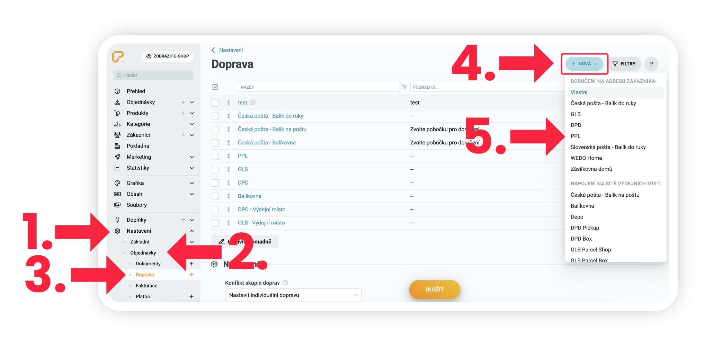
_Obrázek 6: Přidání dopravců z nabídky Upgates_

---

### Nastavení dopravy na adresu

Klikněte na zvoleného dopravce (např. **GLS**, **PPL**, atd.) (Obr. 6, krok 5). Nastavte si parametry dopravy podle sebe 
(např. název, cenu). V horní části nezapomeňte **zaškrtnout Aktivní** (Obr. 7, krok 1). Nakonec klikněte na **Uložit** 
(Obr. 7, krok 2).

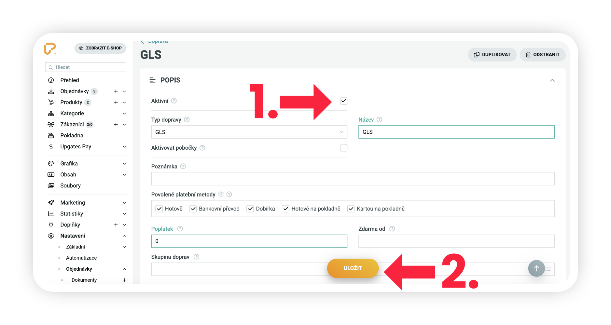
_Obrázek 7: Nastavení dopravy na adresu_

Pro doručení na adresu tímto máte hotovo.

---

### Nastavení dopravy na výdejní místa

Tato nastavení se týkají dopravců s výdejními místy (např. **Balíkovna**, **GLS Parcel Shop**, **PPL Parcel Box**, atd.).

❗ **Nepodporujeme**:

- Česká pošta – Balík na poštu
- Depo
- Slovenská posta - balík na poštu
- Slovenská pošta - BalíkoBOX

Otevřete daného dopravce (např. **GLS – Výdejní místo**). Zaškrtněte možnost **Aktivovat pobočky** (Obr. 8, krok 1). 
V rozbalovací nabídce **Pobočky** (Obr. 8, krok 2) zvolte konkrétní variantu – např. GLS Parcel Shop 
(na výběr máte GLS Parcel Shop, GLS Parcel Box a obě varianty dohromady). Nahoře zaškrtněte **Aktivní** (Obr. 8, krok 3) 
a klikněte na **Uložit** (Obr. 8, krok 4).

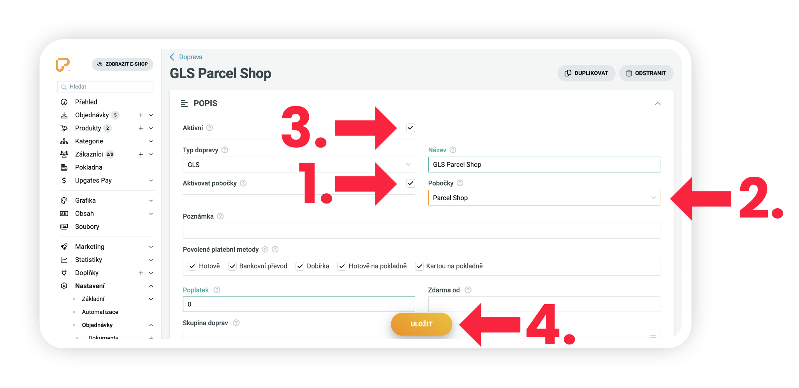
_Obrázek 8: Nastavení dopravy na výdejní místa_

Totéž platí i pro **PPL** – podporujeme všechny 3 možnosti.

---

Zásilkovna má trochu jiný způsob napojení a je potřeba ji rozdělit na **dva samostatné způsoby dopravy.**

1. **Zásilkovna – Výdejní místo**
2. **Zásilkovna – Z‑Boxy**

Opět v nastavení Zásilkovny klikněte na Aktivovat pobočku (Obr. 9, krok 1). U obou variant bude v nastavení systém vyžadovat **API klíč** – můžete klidně zadat např. „zaslat“ (Obr. 9, krok 2). Poté opět Aktivujte (Obr. 9, krok 3) a klikněte na **Uložit** (Obr. 9, krok 14). Stejný postup opakujte, pokud chcete vašim zákazníkům nabídnout také Z-Boxy.

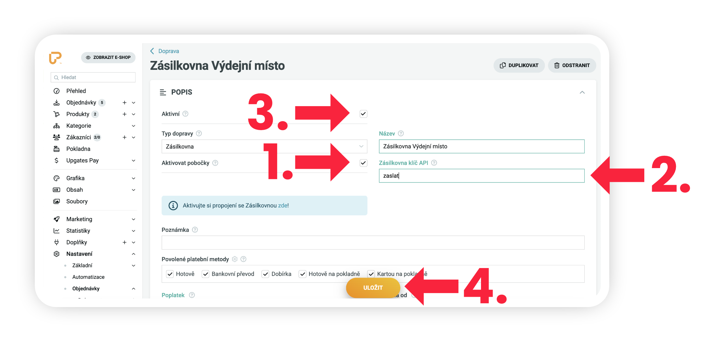
_Obrázek 9: Napojení Zásilkovny_

### Napojení dopravců FedEx, TOPTRANS a UPS

Tyto dopravce **v seznamu přednastavených v Upgates nenajdete**.

Proto je potřeba nastavit je **ručně jako Vlastní přepravu.** Vytvořte nového dopravce přes možnost **Vlastní přeprava** (Obr. 10, krok 1).

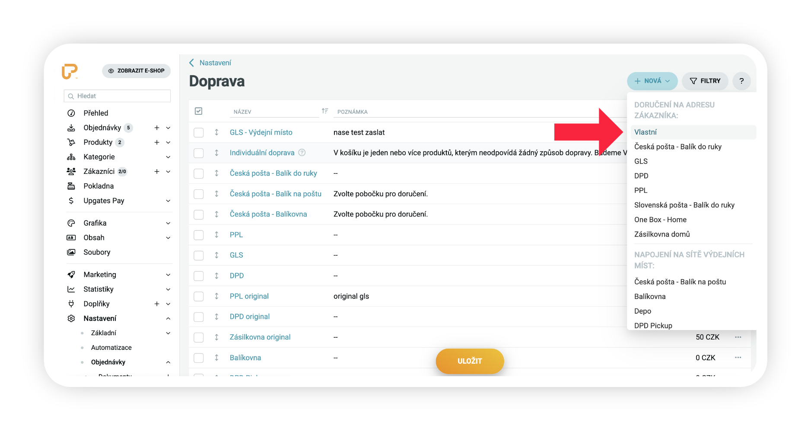
Obrázek 10: Přidání dopravců FedEx, TOPTRANS a UPS

Pojmenujte ho přesně: FedEx, Toptrans, nebo UPS (Obr. 11, krok 1). Nastavte další parametry dle potřeby, klikněte na tlačítko Aktivovat (Obr. 11, krok 2) a nakonec Uložte (Obr. 11, krok 3).

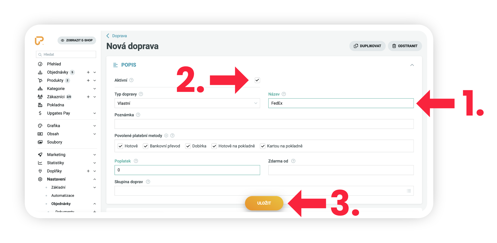
_Obrázek 11: Nastavení dopravy FedEx (nebo TOPTRANS a UPS)_

## Nastavení stavů objednávek

Aby se nepřenášely do Zaslat všechny objednávky z vašeho Upgates, ale jen ty, které chcete přes Zaslat skutečně poslat, musíte si v Upgates nastavit vlastní Stav objednávky. V levém menu klikněte na položku **Nastavení** (Obr. 12, krok 1), zvolte možnost **Objednávky** (Obr. 12, krok 2), poté klikněte v menu na možnost **Stavy** (Obr. 12, krok 3) a v pravém horním roku klikněte na tlačítko **Nový** (Obr. 12, krok 4).

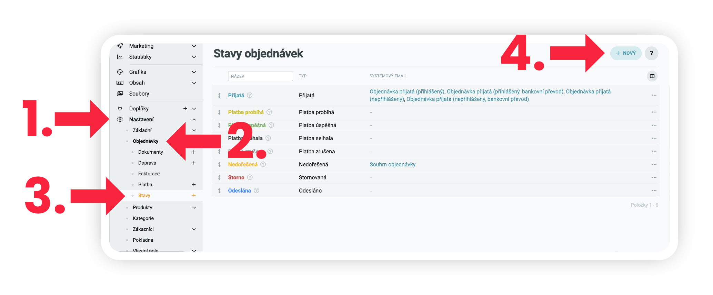
_Obrázek 12: Nastavení stavů objednávek_

Do políčka Název (Obr. 13, krok 1) vepište Zaslat a klikněte na tlačítko Uložit (Obr. 13, krok 2).

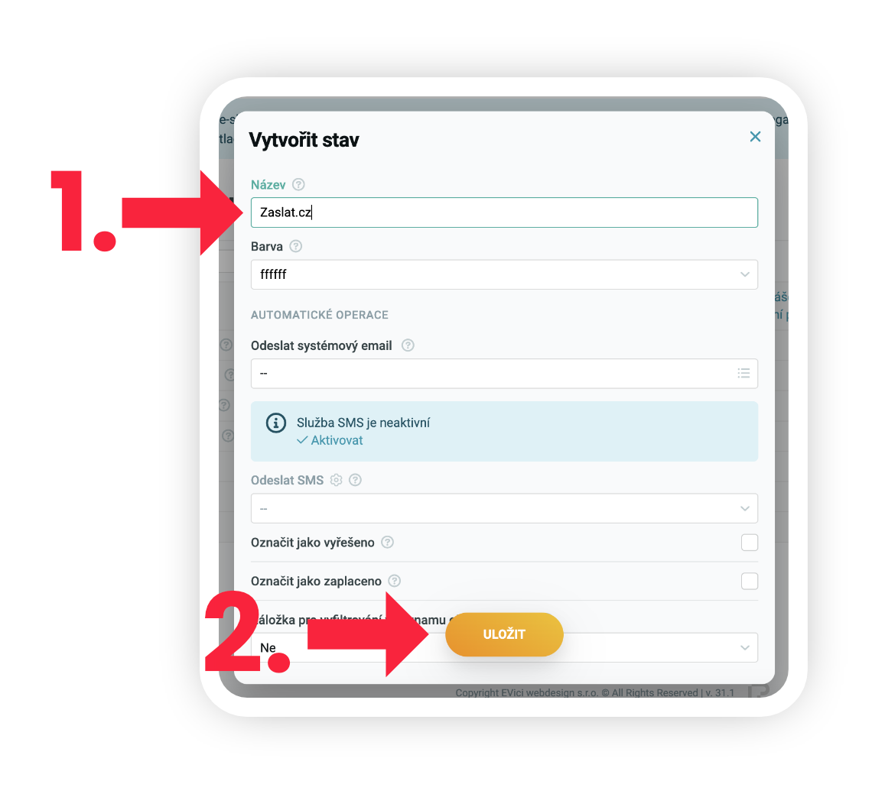
_Obrázek 13: Vytvoření nového stavu Zaslat_

## Přiřazení stavů k objednávkám

Nyní máte nový stav objednávek vytvořený a můžete jej přiřadit ve vašich objednávkách. V detailu objednávky můžete změnit stav objednávky na nový vámi vytvořený stav [Zaslat.cz](http://zaslat.cz/) (Obr. 14).

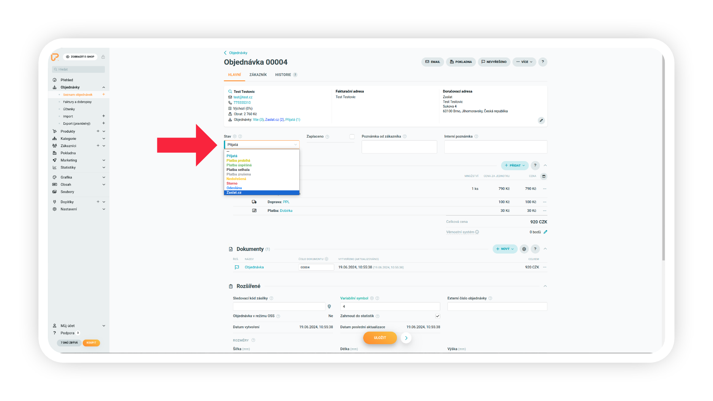
_Obrázek 14: Přiřazení stavů k objednávkám_

# **Import objednávek**

## **Import objednávek do Zaslat a jejich úpravy**

Pokaždé, když budete posílat zásilky, už stačí jen v přehledu objednávek Manažera zásilek aktualizovat objednávky z integrací kliknutím na tlačítko **Synchronizovat integrace** (Obr. 15, krok 1) v pravém horním rohu a všechny objednávky z Upgates vám zobrazíme v uceleném přehledu. Přeprava v tento moment ještě není objednaná, v každé objednávce si můžete cokoliv upravit - adresu odesílatele, příjemce, rozměry, váhu, dobírku, i dopravce. Jakmile si vše zkontrolujete, můžete **Objednat** (Obr. 15, krok 2).

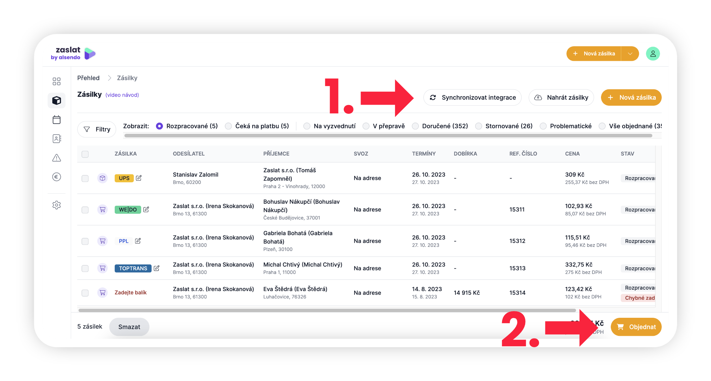
Obrázek 15: Import objednávek